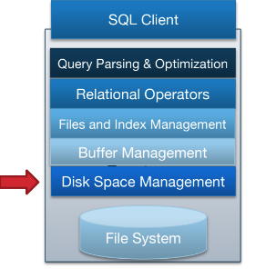
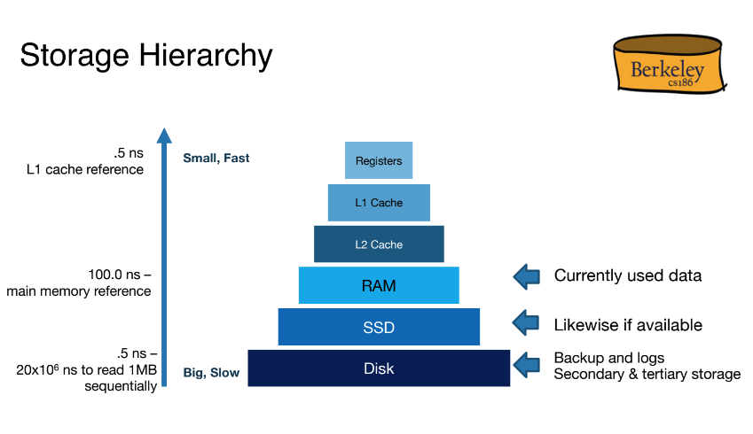
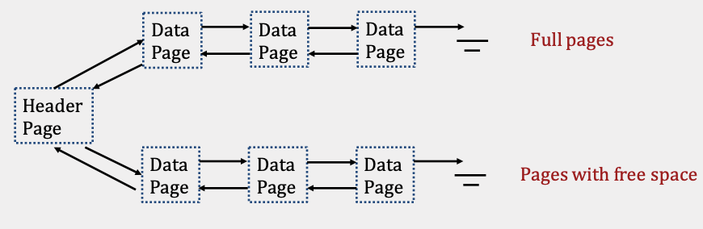
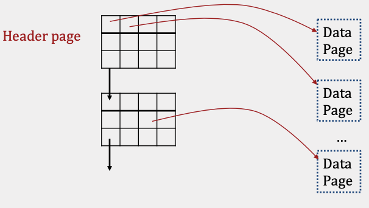

# 
 CS 186 Introduction to Database Systems Note
### 
 Author: ChaoYuan Lin

## Introduction:
> This is a personal note that I created for my learning in Database Management System(DBMS) and future review. My note is based on the notes from UC Berkeley's CS 186: Introduction to Database Systems and you can find the notes [here](https://cs186berkeley.net/notes/).

## Overview:

> There are five main components inside the Database Management Systems:

1. Query Parsing & Optimization
2. Relational Operators
3. Files and index Management
4. Buffer Management
5. Disk Space management

> Numbered from the highest level to the lowest level of the Database Management System(DBMS).

## 1. Disks and Files

### Disk
> - Disks are used to cheaply store all of a database’s data, but they incur a large cost whenever data is accessed or new data is written.
> - Disks includes `READ` and `WRITE` which stands for transferring “pages” of data from disk to RAM and transferring “pages” of data from RAM to disk respectively.
> - `Storage Hierarchy`:

### Disk Space Management
> - Disk Space Management is the lowest layer of DBMS and its main purposes include `mapping pages to locations on disk`, `loading pages from disk to memory`, and `saving pages back to disk` and `ensuring writes`.

### Files, Pages, Records

> - The basic unit of data for relational databases is a `record (row)`. These records are organized into `relations (tables)` and can be `modified`, `deleted`, `searched`, or `created` in memory.
> - Each relation is stored in its own file and its records are organized into pages in the file in relation database.
> - Based on the relation’s schema and access pattern, the database will determine:
> 1. Type of file used
> 2. How pages are organized in the file
> 3. How records are organized on each page
> 4. How each record is formatted

### Files Type

#### - Heap File

1. LinkedList Implementation:
> - In the linked list implementation, each data page contains `records`, a `free space tracker`, and `pointers` (byte offsets) to the `next` and `previous` page.
> - When space is needed, empty pages are allocated and appended to the free pages portion of the list.
> - When free data pages become full, they are moved from the free space portion to the front of the full pages portion of the linked list.

2. Page Directory Implementation:
> - The Page Directory implementation use a linked list for header pages.
> - Each header page contains a pointer (byte offset) to the next header page, and its entries contain both a `pointer to a data page` and `the amount of free space left within that data page`.
> - To find a page with enough space in the Linked List implementation, `the header page and each page in the free portion may need to be read`. In contrast, the Page Directory implementation only `requires reading at most all the header pages`, as they contain information about how much space is left on each data page in the file.
> - Regardless of the implementation used, heap files provide faster insertions than sorted files because `records can be added to any page with free space`, and `finding a page with enough free space is often very cheap`.
> - Searching for records within heap files requires a `full scan` every time. Every record on every page must be looked at because records are `unordered`, resulting in a linear cost of `N I/Os` for every search operation.

#### - Sorted Files
> - A `sorted file` is a file type where pages are ordered and records within each page are sorted by key(s).
> - These files are implemented using Page Directories and enforce an `ordering upon data pages based on how records are sorted`. Searching through sorted files takes `logN I/Os` where `N = # of pages` since `binary search` can be used to find the page containing the record.
> - `Insertion`, in the average case, takes `logN + N I/Os` since `binary search` is needed to find the page to write to and that `inserted record could potentially cause all later records to be pushed back by one`. On average, `N / 2 pages` will need to be pushed back, and this involves `a read` and `a write` IO for each of those pages, which results in the `N I/Os` term.

#### - Record type
> - Record types are completely determined by the relation’s schema and come in 2 types: `Fixed Length Records(FLR)` (`integer`, `boolean`, `date`, `...`.) and `Variable Length Records(VLR)`(`varchar`).
> - VLRs store all fixed length fields before variable length fields and use a record header that contains pointers to the end of the variable length fields.
> - Regardless of the format, every record can be uniquely identified by its record id - (`page #`, `record #`) on page.

| Fixed/Variable |    Type    | Size(B) |
|:--------------:|:----------:|:-------:|
|     Fixed      |  Integer   |    4    |
|     Fixed      |   Float    |    4    | 
|     Fixed      |  Boolean   |    1    |
|     Fixed      |    Byte    |    1    |
|     Fixed      |  Char(N)   |    N    |
|    Variable    | Varchar(N) |  <= N   |
|    Variable    |    Text    |  >= 0   |

#### - Page Formats

1. Pages with Fixed Length Records
> - Pages containing FLRs always use page headers to store the # of records currently on the page.
> - Packed Page:
> > 1. `Insertion`: we can calculate the next available position within the page using the # of existing records and the length of each record.
> > 2. `Deletion` requires moving all records after the deleted record towards the top of the page by one position to keep the page packed.
> - Unpacked Page:
> > 1. the page header typically stores an additional `bitmap` that breaks the page into slots and tracks which slots are open or taken.
> > 2. `Insertion`: Finding the first open bit, setting the new record in the corresponding slot, and then setting the bit for that slot.
> > 3. `Deletion`: We clear the deleted record’s corresponding bit so that future inserts can overwrite that slot.

2. Pages with Variable Length Records
> - Each page uses a `page footer` that maintains a `slot directory` tracking `slot count`, `a free space pointer`, and `entries`.
> - Each entry in the slot directory consists of a (`record pointer`, `record length`) pair.

## 2. Buffer Management

